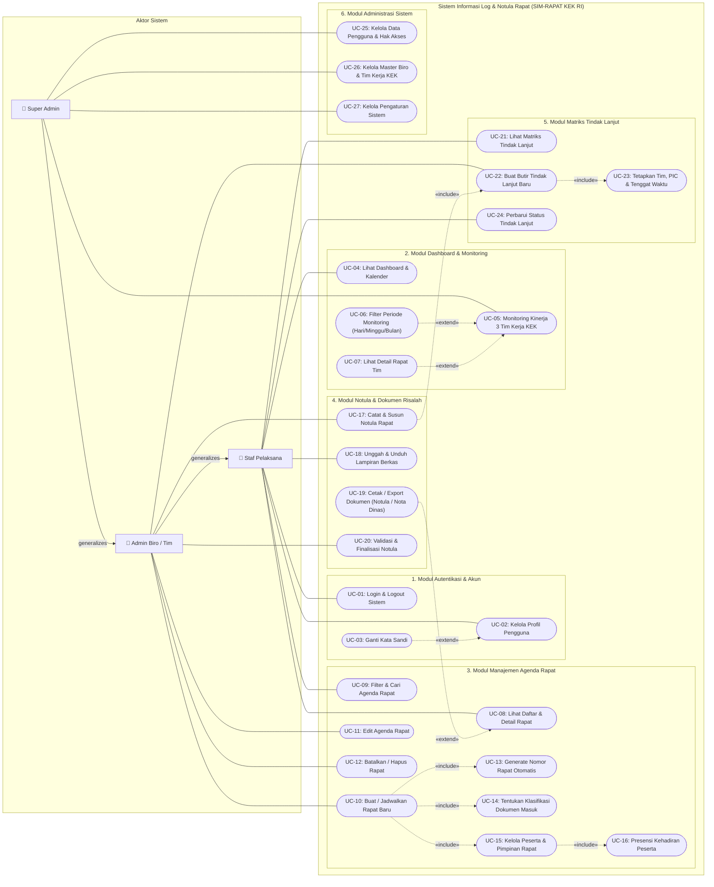

# DOKUMEN PERANCANGAN TAHAP 3: UML USE CASE DIAGRAM
## Sistem Informasi Log & Notula Rapat (SIM-RAPAT KEK RI)
**Sekretariat Jenderal Dewan Nasional Kawasan Ekonomi Khusus Republik Indonesia**

Dokumen ini memuat perancangan resmi **UML Use Case Diagram** untuk Website Log & Notula Rapat KEK, mencakup identifikasi Aktor, Batasan Sistem (*System Boundary*), Relasi Asosiasi, `«include»`, `«extend»`, serta Generalisasi Aktor. Diagram dirancang sesuai kaidah akademik pemodelan perangkat lunak dan **siap dibuka / diimpor langsung ke Draw.io (diagrams.net)**.

---

## 1. File Draw.io Siap Pakai

File diagram Draw.io resmi telah disediakan di repository:
* **Lokasi File Lokal:** [`docs/USE_CASE_SIM_RAPAT.drawio`](file:///c:/Users/nappz/Documents/Project%20Website/Projek%20Log%20Rapat/docs/USE_CASE_SIM_RAPAT.drawio)
* **Tautan Unduh Web:** [http://localhost:3000/USE_CASE_SIM_RAPAT.drawio](http://localhost:3000/USE_CASE_SIM_RAPAT.drawio)

### Cara Membuka di Draw.io (diagrams.net):
1. **Opsi 1 (Buka File Langsung):**
   - Buka peramban ke [app.diagrams.net](https://app.diagrams.net/).
   - Klik menu **File** &rarr; **Open From** &rarr; **Device** (atau drag-and-drop file `USE_CASE_SIM_RAPAT.drawio` ke kanvas).
2. **Opsi 2 (Salin Kode XML):**
   - Buka file `USE_CASE_SIM_RAPAT.drawio` di text editor.
   - Di Draw.io, pilih menu **Arrange** &rarr; **Insert** &rarr; **Advanced** &rarr; **XML**.
   - Tempel (*paste*) kode XML dan klik **Insert**.
3. **Opsi 3 (Impor Mermaid):**
   - Di Draw.io, pilih **Arrange** &rarr; **Insert** &rarr; **Advanced** &rarr; **Mermaid**.
   - Tempel kode Mermaid pada Bagian 3 di bawah ini dan klik **Insert**.

---

## 2. Identifikasi Aktor Sistem

Sistem membedakan pengguna ke dalam 3 tingkatan peran (*role*) hierarki berbasis prinsip **Generalisasi Aktor (*Actor Inheritance*)**:

| No | Nama Aktor | Deskripsi Peran & Tanggung Jawab | Hak Akses Utama |
|:---|:-----------|:--------------------------------|:----------------|
| 1  | **Staf Pelaksana** *(Pegawai / PIC)* | Pegawai internal Sekretariat Dewan Nasional KEK yang menghadiri rapat dinas atau ditugaskan sebagai Penanggung Jawab (PIC) tindak lanjut. | • Login & kelola profil akun. • Melihat dashboard ringkasan & kalender rapat. • Melihat riwayat daftar & detail rapat. • Mengunduh materi & mencetak notula. • Memantau matriks tindak lanjut tim. • Memperbarui progres pekerjaan (*Belum Dimulai, Dalam Proses, Selesai*). |
| 2  | **Admin Biro / Tim** *(Pengelola Rapat)* | Pengelola administrasi persuratan dan notulis pada Biro/Tim Kerja KEK (contoh: Tim Investasi, Tim Kerja Sama, Tim Komunikasi). Mewarisi seluruh hak akses **Staf Pelaksana**. | • **Mewarisi seluruh use case Staf Pelaksana**. • Membuat agenda rapat baru dengan penomoran urut otomatis. • Menentukan klasifikasi naskah masuk (Disposisi Sekjen/Undangan Internal). • Mengelola peserta, pimpinan, dan notulis rapat. • Mengubah & membatalkan agenda rapat. • Mencatat & memvalidasi notula rapat resmi. • Mengunggah lampiran berkas materi. • Membuat butir tindak lanjut & menetapkan PIC serta tenggat waktu. |
| 3  | **Super Admin** *(Pimpinan / Admin Sistem)* | Administrator utama Sekretariat Jenderal Dewan Nasional KEK yang berwenang atas pengawasan menyeluruh dan manajemen sistem. Mewarisi seluruh hak akses **Admin Biro/Tim**. | • **Mewarisi seluruh use case Admin Biro/Tim & Staf**. • Monitoring kinerja & beban kerja 3 Tim Kerja KEK (Investasi, Kerja Sama, Komunikasi). • Melakukan filter periode monitoring (*Semua Waktu, Hari Ini, Minggu Ini, Bulan Ini*). • Navigasi langsung ke rincian rapat tim kerja. • Mengelola data pengguna, penetapan peran (*role*), dan reset sandi. • Mengelola master Biro dan 3 Tim Kerja KEK. • Mengelola pengaturan dan konfigurasi global sistem. |

> [!NOTE]
> **Kaidah Generalisasi Aktor:**
> `Admin Biro / Tim` memiliki relasi generalisasi (*is-a*) ke `Staf Pelaksana`, dan `Super Admin` memiliki relasi generalisasi ke `Admin Biro / Tim`. Dengan demikian, garis asosiasi pada diagram dibuat efisien tanpa pengulangan garis yang membingungkan.

---

## 3. Visualisasi Mermaid Use Case Diagram

Diagram di bawah ini menggambarkan arsitektur fungsional Use Case yang selaras dengan file Draw.io:

---

## 4. Tabel Spesifikasi Rinci Use Case (Katalog Fungsionalitas)

Berikut adalah rincian lengkap 27 Use Case yang mencakup seluruh alur kerja sistem SIM-RAPAT KEK:

### A. Modul Autentikasi & Akun
| ID | Nama Use Case | Aktor Utama | Tipe Relasi | Deskripsi Singkat | Pre-Kondisi | Post-Kondisi |
|:---|:--------------|:------------|:------------|:------------------|:------------|:-------------|
| **UC-01** | Login & Logout Sistem | Staf, Admin, Super Admin | Dasar | Pengguna memverifikasi kredensial email dinas dan password untuk masuk ke sistem. | Akun pengguna berstatus aktif di basis data. | Sesi pengguna terbentuk dan diarahkan ke Dashboard. |
| **UC-02** | Kelola Profil Pengguna | Staf, Admin, Super Admin | Dasar | Pengguna melihat dan memperbarui informasi identitas profil pribadinya. | Pengguna telah login ke sistem. | Data profil tersimpan di database. |
| **UC-03** | Ganti Kata Sandi | Staf, Admin, Super Admin | `«extend»` ke UC-02 | Pengguna memperbarui kata sandi akun secara mandiri untuk keamanan. | Pengguna berada di halaman profil pengguna. | Kata sandi terenkripsi baru berhasil disimpan. |

### B. Modul Dashboard & Monitoring Kinerja
| ID | Nama Use Case | Aktor Utama | Tipe Relasi | Deskripsi Singkat | Pre-Kondisi | Post-Kondisi |
|:---|:--------------|:------------|:------------|:------------------|:------------|:-------------|
| **UC-04** | Lihat Dashboard Ringkasan & Kalender | Staf, Admin, Super Admin | Dasar | Menampilkan kartu metrik eksekutif, agenda rapat mendatang, tren bulanan, dan kalender. | Pengguna telah berhasil login. | Data agregasi statistik ditampilkan di layar. |
| **UC-05** | Monitoring Kinerja 3 Tim Kerja KEK | Super Admin | Dasar | Menampilkan beban kerja dan status penyelesaian tugas 3 Tim Kerja (Investasi, Kerja Sama, Komunikasi). | Pengguna memiliki hak akses Super Admin. | Modal monitoring dan grafik beban kerja terbuka. |
| **UC-06** | Filter Periode Kinerja Tim | Super Admin | `«extend»` ke UC-05 | Menyaring indikator kinerja tim berdasarkan pilihan waktu (*Semua Waktu, Hari Ini, Minggu Ini, Bulan Ini*). | Modal monitoring kinerja tim terbuka. | Angka KPI dan daftar rapat/pekerjaan terfilter secara reaktif. |
| **UC-07** | Lihat Detail Rapat Tim Langsung | Super Admin | `«extend»` ke UC-05 | Membuka rincian notula rapat langsung dari kartu atau baris pekerjaan tim. | Modal monitoring kinerja tim terbuka. | Halaman rincian rapat (`/semua-rapat/[id]`) terbuka. |

### C. Modul Manajemen Agenda Rapat
| ID | Nama Use Case | Aktor Utama | Tipe Relasi | Deskripsi Singkat | Pre-Kondisi | Post-Kondisi |
|:---|:--------------|:------------|:------------|:------------------|:------------|:-------------|
| **UC-08** | Lihat Daftar & Detail Rapat | Staf, Admin, Super Admin | Dasar | Menampilkan daftar seluruh agenda rapat dinas beserta rincian informasi dan statusnya. | Pengguna memiliki sesi login aktif. | Informasi rapat tersaji lengkap. |
| **UC-09** | Filter & Cari Agenda Rapat | Staf, Admin, Super Admin | Dasar | Melakukan pencarian berdasarkan nomor rapat, judul, biro, tim kerja, dan tanggal. | Pengguna berada di halaman Semua Rapat. | Daftar tabel rapat terfilter sesuai kata kunci. |
| **UC-10** | Buat / Jadwalkan Rapat Baru | Admin, Super Admin | Dasar | Mendaftarkan rapat dinas baru dengan formulir data lengkap. | Pengguna memiliki hak akses Admin / Super Admin. | Data agenda rapat baru tersimpan di tabel `rapat`. |
| **UC-11** | Edit Agenda Rapat | Admin, Super Admin | Dasar | Mengubah judul, waktu, lokasi, atau deskripsi agenda rapat yang belum berstatus final. | Rapat telah terdaftar dan belum final. | Perubahan agenda rapat tersimpan. |
| **UC-12** | Batalkan / Hapus Rapat | Admin, Super Admin | Dasar | Membatalkan rapat atau menghapus draf agenda rapat yang dibatalkan pimpinan. | Rapat terdaftar di sistem. | Rapat terhapus / status menjadi dibatalkan. |
| **UC-13** | Generate Nomor Rapat Otomatis | Sistem | `«include»` oleh UC-10 | Sistem otomatis menghitung nomor urut dan menyusun kode surat rapat dinas (misal: `INV-014`). | Form penjadwalan rapat diinisialisasi. | Nomor rapat unik tercatat pada tabel penomoran. |
| **UC-14** | Tentukan Kategori Dokumen Masuk | Admin, Super Admin | `«include»` oleh UC-10 | Menetapkan dasar undangan (Disposisi Sekjen, Undangan Internal, Naskah Masuk SRIKANDI). | Form penjadwalan rapat sedang diisi. | Klasifikasi tersimpan pada data rapat. |
| **UC-15** | Kelola Peserta & Pimpinan Rapat | Admin, Super Admin | `«include»` oleh UC-10 | Menentukan ketua sidang, notulis, biro pemrakarsa, dan daftar pegawai yang diundang. | Data rapat sedang dibuat atau diedit. | Daftar peserta tersimpan di tabel `peserta_rapat`. |
| **UC-16** | Presensi Kehadiran Peserta | Admin, Super Admin | `«include»` oleh UC-15 | Mencatat status kehadiran peserta rapat (*Hadir, Tidak Hadir, Izin, Diundang*). | Rapat telah terselenggara. | Status kehadiran peserta terbarui. |

### D. Modul Notula & Dokumen Risalah Rapat
| ID | Nama Use Case | Aktor Utama | Tipe Relasi | Deskripsi Singkat | Pre-Kondisi | Post-Kondisi |
|:---|:--------------|:------------|:------------|:------------------|:------------|:-------------|
| **UC-17** | Catat & Susun Notula Rapat | Admin (Notulis), Super Admin | Dasar | Menginput poin-poin pembahasan rapat, arahan pimpinan, keputusan, dan kesimpulan. | Rapat telah dibuat dan berlangsung. | Notula tersimpan di tabel `notulen_rapat`. |
| **UC-18** | Unggah & Unduh Berkas Lampiran | Staf, Admin, Super Admin | Dasar | Mengunggah materi presentasi, naskah dinas, atau mengunduh berkas pendukung rapat. | Rapat terdaftar di sistem. | File tersimpan di storage dan metadata di tabel lampiran. |
| **UC-19** | Cetak / Export Dokumen Resmi | Staf, Admin, Super Admin | `«extend»` ke UC-08 | Mengenerate naskah Notula resmi atau Nota Dinas berstandar tata naskah KEK dalam format cetak/PDF. | Rapat memiliki notula yang tersusun. | Naskah cetak siap unduh atau print. |
| **UC-20** | Validasi & Finalisasi Notula | Admin, Super Admin | Dasar | Mengubah status notula menjadi Final/Disetujui setelah diverifikasi pimpinan. | Notula berstatus draf atau tinjauan. | Notula berstatus final dan terkunci dari perubahan. |

### E. Modul Matriks Tindak Lanjut (Action Items)
| ID | Nama Use Case | Aktor Utama | Tipe Relasi | Deskripsi Singkat | Pre-Kondisi | Post-Kondisi |
|:---|:--------------|:------------|:------------|:------------------|:------------|:-------------|
| **UC-21** | Lihat Matriks Tindak Lanjut | Staf, Admin, Super Admin | Dasar | Menampilkan tabel matriks seluruh butir instruksi rapat dengan status, prioritas, dan PIC. | Pengguna telah login ke sistem. | Matriks tindak lanjut tampil terstruktur. |
| **UC-22** | Buat Butir Tindak Lanjut Baru | Admin, Super Admin | `«include»` oleh UC-17 | Menambahkan butir pekerjaan konkret yang diputuskan dalam agenda rapat dinas. | Rapat memiliki butir arahan/keputusan. | Record tersimpan di tabel `tindak_lanjut`. |
| **UC-23** | Tetapkan Tim, PIC & Tenggat Waktu | Admin, Super Admin | `«include»` oleh UC-22 | Mengalokasikan tanggung jawab kepada Tim Kerja (INV/KS/KOM), pegawai (PIC), dan tanggal batas waktu. | Butir tindak lanjut dibuat. | PIC dan due date terasosiasi ke record. |
| **UC-24** | Perbarui Status Tindak Lanjut | Staf (PIC), Admin, Super Admin | Dasar | Memperbarui perkembangan pelaksanaan pekerjaan (*Belum Dimulai, Dalam Proses, Selesai*). | PIC memiliki butir penugasan aktif. | Status dan persentase progres pekerjaan terbarui. |

### F. Modul Administrasi Sistem
| ID | Nama Use Case | Aktor Utama | Tipe Relasi | Deskripsi Singkat | Pre-Kondisi | Post-Kondisi |
|:---|:--------------|:------------|:------------|:------------------|:------------|:-------------|
| **UC-25** | Kelola Data Pengguna & Hak Akses | Super Admin | Dasar | Menambah, menyunting data pegawai, menetapkan biro/tim, mengatur peran (*role*), dan menonaktifkan akun. | Pengguna berstatus Super Admin. | Data akun pengguna terbarui di database. |
| **UC-26** | Kelola Master Biro & Tim Kerja KEK | Super Admin | Dasar | Mengatur data master unit kerja Biro IKK serta 3 Tim Kerja KEK (Investasi, Kerja Sama, Komunikasi). | Pengguna berstatus Super Admin. | Struktur organisasi unit kerja tersinkronisasi. |
| **UC-27** | Kelola Pengaturan Sistem | Super Admin | Dasar | Mengonfigurasi parameter aplikasi, format penomoran surat, dan preferensi sistem. | Pengguna berstatus Super Admin. | Konfigurasi sistem tersimpan. |

---

## 5. Ringkasan Prinsip Relasi UML yang Diterapkan

1. **Relasi Asosiasi (*Association - Garis Lurus Tanpa Panah*):**
   Menghubungkan Aktor dengan Use Case yang dapat diinisiasi atau diakses langsung oleh aktor tersebut.
2. **Relasi Generalisasi (*Generalization - Garis Berujung Panah Segitiga Kosong*):**
   - `Admin Biro / Tim` &rarr; `Staf Pelaksana`: Segala fungsionalitas yang dapat dilakukan oleh Staf otomatis dapat dilakukan oleh Admin.
   - `Super Admin` &rarr; `Admin Biro / Tim`: Segala fungsionalitas Admin otomatis dapat dilakukan oleh Super Admin.
3. **Relasi `«include»` (*Panah Putus-putus ke Arah Use Case Sasaran*):**
   Menunjukkan bahwa Use Case induk **selalu dan wajib** mengeksekusi Use Case anak untuk menyelesaikan tugasnya (contoh: *Buat Rapat* **wajib menyertakan** *Generate Nomor Rapat Otomatis*, *Tentukan Kategori*, dan *Kelola Peserta*).
4. **Relasi `«extend»` (*Panah Putus-putus ke Arah Use Case Induk*):**
   Menunjukkan bahwa Use Case perluasan menyediakan kemampuan **tambahan/opsional** di bawah kondisi tertentu (contoh: *Cetak / Export Dokumen* memperluas *Lihat Detail Rapat*; *Filter Periode Tanggal* memperluas *Monitoring Kinerja Tim*).

---

*Dokumen ini merupakan bagian dari rangkaian dokumentasi resmi rekayasa perangkat lunak SIM-RAPAT KEK RI ([Tahap 1: ERD](file:///c:/Users/nappz/Documents/Project%20Website/Projek%20Log%20Rapat/docs/1_ERD_DIAGRAM.md) &bull; [Tahap 2: LRS](file:///c:/Users/nappz/Documents/Project%20Website/Projek%20Log%20Rapat/docs/2_LRS_DIAGRAM.md) &bull; [Tahap 3: Use Case](file:///c:/Users/nappz/Documents/Project%20Website/Projek%20Log%20Rapat/docs/3_USE_CASE_DIAGRAM.md)).*
