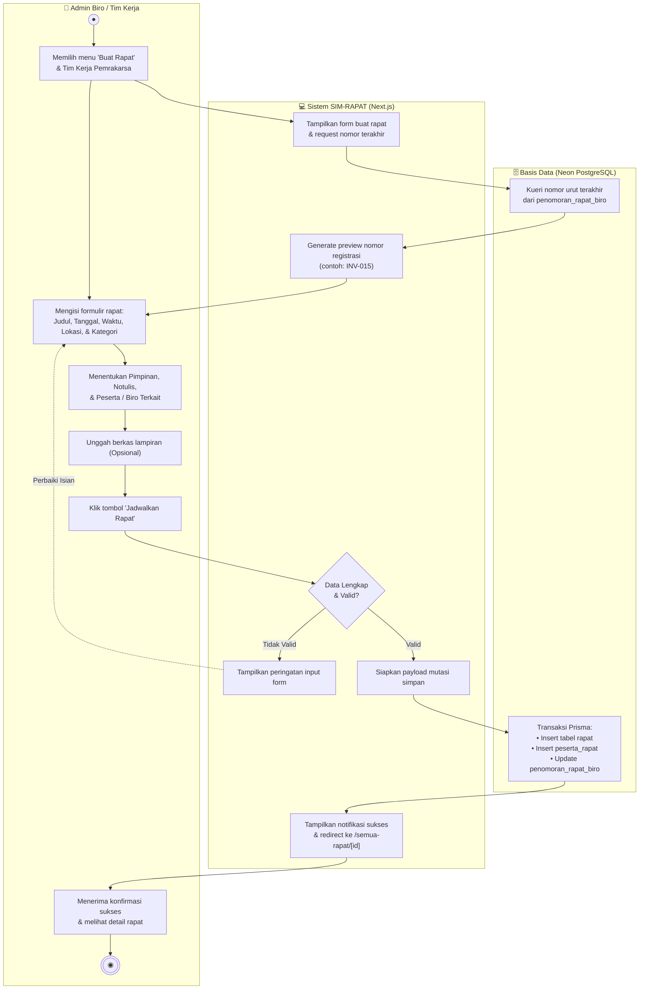
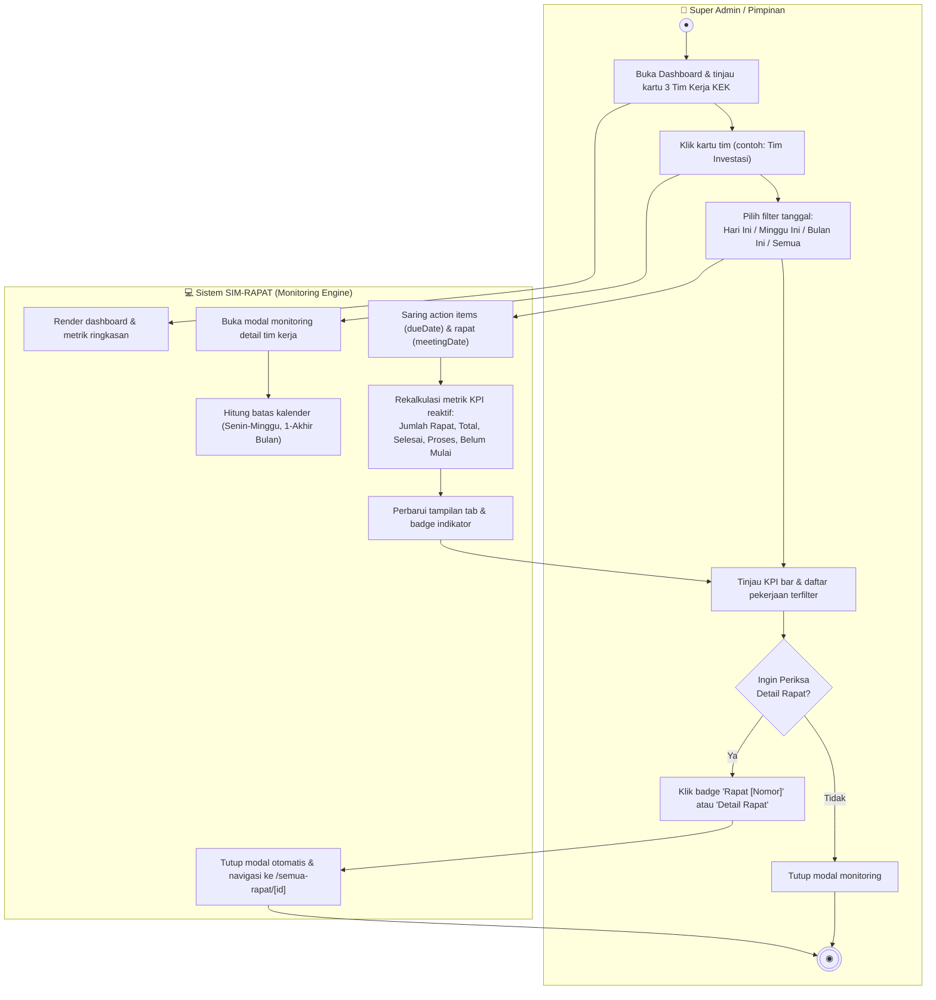
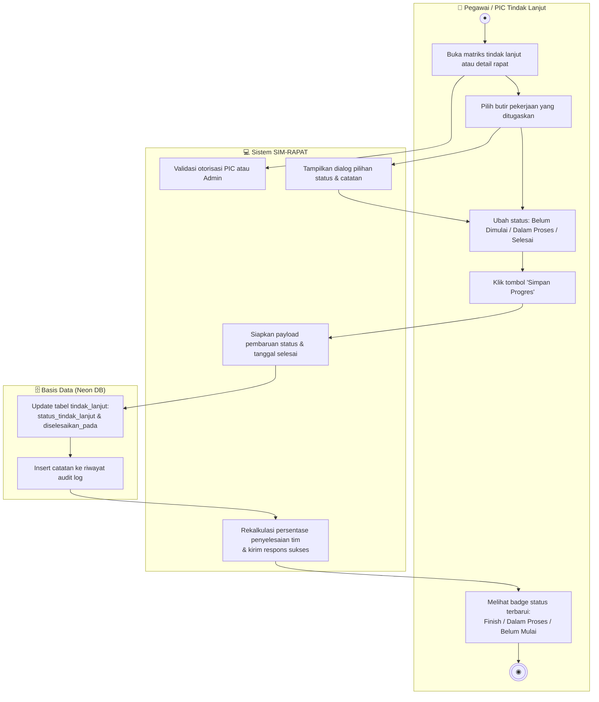
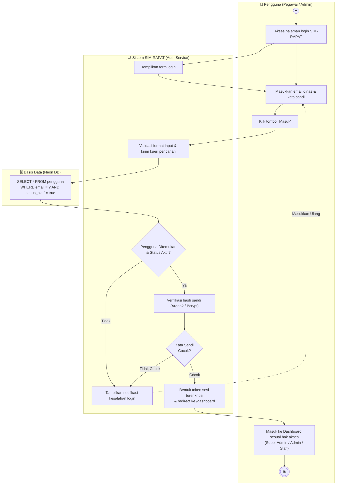

# DOKUMEN PERANCANGAN TAHAP 4: UML ACTIVITY DIAGRAM (ALUR AKTIVITAS)
## Sistem Informasi Log & Notula Rapat (SIM-RAPAT KEK RI)
**Sekretariat Jenderal Dewan Nasional Kawasan Ekonomi Khusus Republik Indonesia**

Dokumen ini memuat perancangan resmi **UML Activity Diagram (Diagram Aktivitas)** dengan pemisahan jalur tanggung jawab (*Swimlanes: Aktor, Sistem, & Basis Data*), memodelkan 5 proses bisnis inti yang beroperasi pada Website Log & Notula Rapat KEK. File diagram telah disusun dalam format **Multi-Page Draw.io (`.drawio`)**, siap dibuka dan diedit di **Draw.io (diagrams.net)**.

---

## 1. File Draw.io Siap Pakai

File diagram Draw.io resmi berformat *multi-page* telah disediakan di repository:
* **Lokasi File Lokal:** [`docs/ACTIVITY_DIAGRAM_SIM_RAPAT.drawio`](file:///c:/Users/nappz/Documents/Project%20Website/Projek%20Log%20Rapat/docs/ACTIVITY_DIAGRAM_SIM_RAPAT.drawio)
* **Tautan Unduh Web:** [http://localhost:3000/ACTIVITY_DIAGRAM_SIM_RAPAT.drawio](http://localhost:3000/ACTIVITY_DIAGRAM_SIM_RAPAT.drawio)

> [!TIP]
> **Format Multi-Page Draw.io:**
> Saat dibuka di Draw.io, file ini otomatis menampilkan **5 lembar diagram (tab) terpisah** di bagian bawah kanvas:
> 1. `AD-01: Penjadwalan Rapat Baru`
> 2. `AD-02: Notula & Tindak Lanjut`
> 3. `AD-03: Monitoring & Filter Periode`
> 4. `AD-04: Progres Tindak Lanjut (PIC)`
> 5. `AD-05: Autentikasi & Login`

---

## 2. Ringkasan 5 Diagram Aktivitas Inti

| Kode Diagram | Nama Alur Aktivitas | Aktor Utama | Tujuan Proses Bisnis |
|:---|:---|:---|:---|
| **AD-01** | **Penjadwalan Rapat Dinas Baru** | Admin Biro / Tim Kerja | Menjadwalkan rapat dinas baru dengan penomoran urut otomatis dari tabel `penomoran_rapat_biro`, klasifikasi naskah masuk, dan penugasan peserta. |
| **AD-02** | **Penyusunan Notula & Tindak Lanjut** | Notulis / Admin Biro | Mencatat jalannya rapat dinas, poin bahasan, arahan pimpinan, serta merumuskan butir-butir *Action Items* langsung ke basis data. |
| **AD-03** | **Monitoring Kinerja Tim & Filter Periode** | Super Admin / Pimpinan | Memantau KPI penyelesaian tugas 3 Tim Kerja KEK (INV, KS, KOM), memfilter periode waktu (*Hari Ini, Minggu Ini, Bulan Ini*), dan investigasi detail rapat. |
| **AD-04** | **Pembaruan Status Tindak Lanjut (PIC)** | Pegawai / PIC Penugasan | Memperbarui siklus hidup pekerjaan tindak lanjut (*Belum Dimulai &rarr; Dalam Proses &rarr; Selesai*) beserta pencatatan audit log riwayat progres. |
| **AD-05** | **Autentikasi Pengguna & Validasi Sesi** | Seluruh Pengguna (Staff/Admin/Super) | Memverifikasi kredensial email dinas & kata sandi terenkripsi, membentuk sesi login aman, dan mengarahkan ke dashboard sesuai hak akses. |

---

## 3. Rincian & Visualisasi Mermaid Tiap Alur Aktivitas

---

### AD-01: Penjadwalan Rapat Dinas Baru
Memodelkan proses ketika Admin Biro/Tim menjadwalkan rapat dinas baru hingga tersimpan di basis data Neon DB.

---

### AD-02: Penyusunan Notula & Butir Tindak Lanjut
Memodelkan alur pencatatan jalannya rapat dinas, poin keputusan, dan perumusan butir *Action Items*.

```mermaid
flowchart TD
    subgraph NOTULIS["👤 Notulis / Admin Biro"]
        N_Start((●)) --> N1["Buka detail rapat & pilih tab 'Notula'"]
        N1 --> N2["Input poin pembahasan, arahan pimpinan,<br>keputusan, & kesimpulan"]
        N2 --> N3["Tambah butir tindak lanjut:<br>Judul, Tim PIC, Pegawai PIC, & Due Date"]
        N3 --> N4["Klik tombol 'Simpan Notula & Tindak Lanjut'"]
        N_Review["Melihat notula & matriks tindak lanjut terkini"]
        N_Print["Cetak / Export dokumen Notula atau Nota Dinas"] --> N_End(((◉)))
    end

    subgraph SYSTEM["💻 Sistem SIM-RAPAT"]
        S_Editor["Tampilkan editor risalah & form action items"]
        S_Val{"Validasi Data<br>Notula Berhasil?"}
        S_Warn["Tampilkan pesan validasi input"]
        S_Process["Kirim mutasi simpan ke Server Action"]
        S_Success["Kalkulasi ulang status progres rapat<br>& kirim respons sukses"]
    end

    subgraph DATABASE["🗄️ Basis Data (Neon DB)"]
        DB_Read["Kueri draft notula terdahulu"]
        DB_Write["Eksekusi Penyimpanan:<br>• Upsert tabel notulen_rapat<br>• Insert batch tabel tindak_lanjut<br>• Update status_rapat"]
    end

    N1 --> S_Editor
    S_Editor --> DB_Read
    DB_Read --> N2
    N4 --> S_Val
    S_Val -- Gagal --> S_Warn
    S_Warn -. Perbaiki Data .-> N2
    S_Val -- Sukses --> S_Process
    S_Process --> DB_Write
    DB_Write --> S_Success
    S_Success --> N_Review
    N_Review --> N_Print
```

---

### AD-03: Pemantauan Kinerja Tim Kerja & Filter Periode Tanggal
Memodelkan alur pemantauan beban kerja 3 Tim Kerja KEK pada modal monitoring eksekutif berserta filter waktu reaktif.

---

### AD-04: Pembaruan Status Tindak Lanjut oleh PIC
Memodelkan bagaimana staf atau penanggung jawab memperbarui perkembangan butir pekerjaan.

---

### AD-05: Autentikasi Pengguna & Validasi Sesi
Memodelkan alur masuk (*login*) pengguna ke dalam sistem informasi.

---

## 4. Standar Notasi UML Activity Diagram yang Diterapkan

1. **Initial Node (`●`):** Lingkaran hitam pekat menandai titik awal dimulainya alur aktivitas.
2. **Action State (Persegi Panjang Tumpul):** Merepresentasikan langkah pekerjaan atau operasi yang dilakukan oleh sistem atau aktor.
3. **Decision Node (`◇`):** Belah ketupat percabangan logika dengan kondisi pengaman (*guard conditions*) tertulis pada setiap cabang keluaran (misal: `[Valid]` vs `[Tidak Valid]`).
4. **Swimlanes (Jalur Partisi Kolom):** Memisahkan tanggung jawab kerja secara eksplisit antara:
   - **Aktor Pengguna** (Staf / Admin / Pimpinan)
   - **Sistem Perangkat Lunak** (Aplikasi Antarmuka & Logika Server Next.js)
   - **Basis Data** (Neon PostgreSQL / Prisma ORM)
5. **Activity Final Node (`◉`):** Lingkaran ganda (*bullseye*) menandai akhir dari suatu alur aktivitas.

---

*Dokumen ini merupakan bagian dari rangkaian dokumentasi resmi rekayasa perangkat lunak SIM-RAPAT KEK RI ([Tahap 1: ERD](file:///c:/Users/nappz/Documents/Project%20Website/Projek%20Log%20Rapat/docs/1_ERD_DIAGRAM.md) &bull; [Tahap 2: LRS](file:///c:/Users/nappz/Documents/Project%20Website/Projek%20Log%20Rapat/docs/2_LRS_DIAGRAM.md) &bull; [Tahap 3: Use Case](file:///c:/Users/nappz/Documents/Project%20Website/Projek%20Log%20Rapat/docs/3_USE_CASE_DIAGRAM.md) &bull; [Tahap 4: Activity Diagram](file:///c:/Users/nappz/Documents/Project%20Website/Projek%20Log%20Rapat/docs/4_ACTIVITY_DIAGRAM.md)).*
