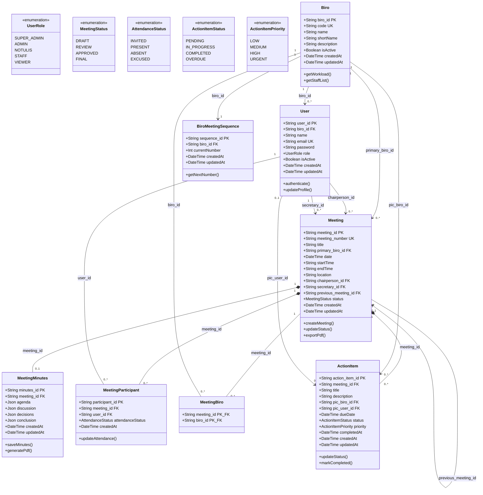

# DOKUMENTASI LENGKAP STRUKTUR IDENTITAS TABEL, UML CLASS DIAGRAM, & ERD
## Sistem Informasi Manajemen Rapat & Tindak Lanjut (SIM-RAPAT KEK RI)
**Sekretariat Jenderal Dewan Nasional Kawasan Ekonomi Khusus Republik Indonesia**

Dokumen ini memuat standarisasi penamaan Primary Key (PK) & Foreign Key (FK), Kamus Data, UML Class Diagram, dan Entity Relationship Diagram (ERD) untuk keperluan analisis, perancangan sistem, penulisan laporan teknis, maupun tugas akhir/skripsi.

---

## 1. Kamus Data & Standarisasi Nama ID Tabel (Data Dictionary)

Dalam perancangan basis data dan pemodelan UML profesional, setiap tabel memiliki identitas Primary Key (PK) yang eksplisit dan deskriptif:

| No | Nama Tabel / Entitas | Primary Key (PK) | Foreign Key (FK) | Relasi & Deskripsi |
|:---|:---------------------|:-----------------|:-----------------|:-------------------|
| 1  | **`biro`** | `biro_id` *(UUID)* | - | Master 5 Biro resmi di Sekretariat Jenderal Dewan Nasional KEK (`code`: BPPK, PKKEK, IKK, HSDMO, UK). |
| 2  | **`user`** | `user_id` *(UUID)* | `biro_id` → `biro.biro_id` | Data pengguna/pegawai, PIC tindak lanjut, dan akun pimpinan sidang. |
| 3  | **`meeting`** | `meeting_id` *(UUID)* | • `primary_biro_id` → `biro.biro_id`<br>• `chairperson_id` → `user.user_id`<br>• `secretary_id` → `user.user_id`<br>• `previous_meeting_id` → `meeting.meeting_id` | Entitas utama agenda rapat dinas KEK. Memiliki Unique Key `meeting_number`. |
| 4  | **`meeting_minutes`** | `minutes_id` *(UUID)* | `meeting_id` → `meeting.meeting_id` *(1:1 Unique)* | Dokumen naskah notula resmi (agenda, substansi pembahasan, keputusan, dan penandatangan). |
| 5  | **`meeting_participant`** | `participant_id` *(UUID)* | • `meeting_id` → `meeting.meeting_id`<br>• `user_id` → `user.user_id` | Daftar absensi peserta sidang dan status kehadiran (`INVITED`, `PRESENT`, `ABSENT`, `EXCUSED`). |
| 6  | **`meeting_biro`** | `(meeting_id, biro_id)` *(Composite PK)* | • `meeting_id` → `meeting.meeting_id`<br>• `biro_id` → `biro.biro_id` | Tabel pivot/junction relasi Many-to-Many untuk biro-biro yang terlibat dalam rapat. |
| 7  | **`action_item`** | `action_item_id` *(UUID)* | • `meeting_id` → `meeting.meeting_id`<br>• `pic_biro_id` → `biro.biro_id`<br>• `pic_user_id` → `user.user_id` *(Opsional)* | Butir arahan/resolusi tindak lanjut hasil rapat, tenggat waktu (*due date*), status, dan prioritas. |
| 8  | **`biro_meeting_sequence`** | `sequence_id` *(UUID)* | `biro_id` → `biro.biro_id` *(1:1 Unique)* | Generator penomoran urut surat rapat otomatis per biro (contoh: `IKK-015`). |
| 9  | **`account`** | `account_id` *(UUID)* | `user_id` → `user.user_id` | Penyimpanan otentikasi login OAuth dan kredensial aman (NextAuth). |
| 10 | **`session`** | `session_id` *(UUID)* | `user_id` → `user.user_id` | Penyimpanan token sesi aktif pengguna (NextAuth). |

---

## 2. UML Class Diagram (Mermaid Syntax)



---

## 3. Entity Relationship Diagram (ERD - Physical Data Model)

```mermaid
erDiagram
    BIRO ||--o{ USER : "memiliki pegawai"
    BIRO ||--o{ MEETING : "menyelenggarakan"
    BIRO ||--|| BIRO_MEETING_SEQUENCE : "nomor urut surat"
    BIRO ||--o{ ACTION_ITEM : "penanggung jawab biro"
    BIRO ||--o{ MEETING_BIRO : "terlibat sidang"

    USER ||--o{ MEETING_PARTICIPANT : "kehadiran sidang"
    USER ||--o{ ACTION_ITEM : "PIC personal"
    USER ||--o{ MEETING : "pimpinan atau notulis"

    MEETING ||--|| MEETING_MINUTES : "memiliki 1 dokumen naskah"
    MEETING ||--o{ ACTION_ITEM : "menghasilkan resolusi"
    MEETING ||--o{ MEETING_PARTICIPANT : "daftar peserta"
    MEETING ||--o{ MEETING_BIRO : "biro terlibat"
    MEETING ||--o| MEETING : "rujukan rapat sebelumnya"

    BIRO {
        string biro_id PK "UUID"
        string code UK "Kode Biro (IKK/BPPK/dll)"
        string name "Nama Lengkap Biro"
        string shortName "Nama Singkat Biro"
        string description "Deskripsi Tugas"
        boolean isActive "Status Aktif"
        datetime createdAt "Waktu Dibuat"
        datetime updatedAt "Waktu Diubah"
    }

    USER {
        string user_id PK "UUID"
        string biro_id FK "Relasi ke BIRO"
        string name "Nama Pengguna"
        string email UK "Email Login"
        string password "Password Terenkripsi"
        string role "UserRole (SUPER_ADMIN/ADMIN/dll)"
        boolean isActive "Status Akun Aktif"
        datetime createdAt "Waktu Dibuat"
        datetime updatedAt "Waktu Diubah"
    }

    MEETING {
        string meeting_id PK "UUID"
        string meeting_number UK "Nomor Surat Rapat (IKK-015)"
        string primary_biro_id FK "Biro Penyelenggara"
        string chairperson_id FK "Pimpinan Sidang (User)"
        string secretary_id FK "Notulis Sidang (User)"
        string previous_meeting_id FK "Rujukan Rapat Sebelumnya"
        string title "Judul Rapat"
        datetime date "Tanggal Pelaksanaan"
        string startTime "Waktu Mulai"
        string endTime "Waktu Selesai"
        string location "Ruang Rapat / Tautan Virtual"
        string status "Status (DRAFT/REVIEW/APPROVED/FINAL)"
        datetime createdAt "Waktu Dibuat"
        datetime updatedAt "Waktu Diubah"
    }

    MEETING_MINUTES {
        string minutes_id PK "UUID"
        string meeting_id FK "Relasi Unik ke MEETING"
        json agenda "Agenda Pembahasan"
        json discussion "Substansi Pembahasan"
        json decisions "Keputusan / Hasil Sidang"
        json conclusion "Pengesahan, Pimpinan, dan TTD"
        datetime createdAt "Waktu Dibuat"
        datetime updatedAt "Waktu Diubah"
    }

    ACTION_ITEM {
        string action_item_id PK "UUID"
        string meeting_id FK "Relasi ke MEETING"
        string pic_biro_id FK "Biro Penanggung Jawab"
        string pic_user_id FK "Pegawai PIC Spesifik"
        string title "Judul Tindak Lanjut"
        string description "Deskripsi Tindak Lanjut"
        datetime dueDate "Tenggat Waktu Selesai"
        string status "Status (PENDING/IN_PROGRESS/dll)"
        string priority "Prioritas (LOW/MEDIUM/HIGH/URGENT)"
        datetime completedAt "Waktu Selesai"
        datetime createdAt "Waktu Dibuat"
        datetime updatedAt "Waktu Diubah"
    }

    MEETING_PARTICIPANT {
        string participant_id PK "UUID"
        string meeting_id FK "Relasi ke MEETING"
        string user_id FK "Relasi ke USER"
        string attendanceStatus "Status Kehadiran"
        datetime createdAt "Waktu Dicatat"
    }

    MEETING_BIRO {
        string meeting_id PK_FK "Relasi ke MEETING"
        string biro_id PK_FK "Relasi ke BIRO"
    }

    BIRO_MEETING_SEQUENCE {
        string sequence_id PK "UUID"
        string biro_id FK "Relasi Unik ke BIRO"
        int currentNumber "Nomor Urut Terakhir"
        datetime createdAt "Waktu Dibuat"
        datetime updatedAt "Waktu Diubah"
    }
```
